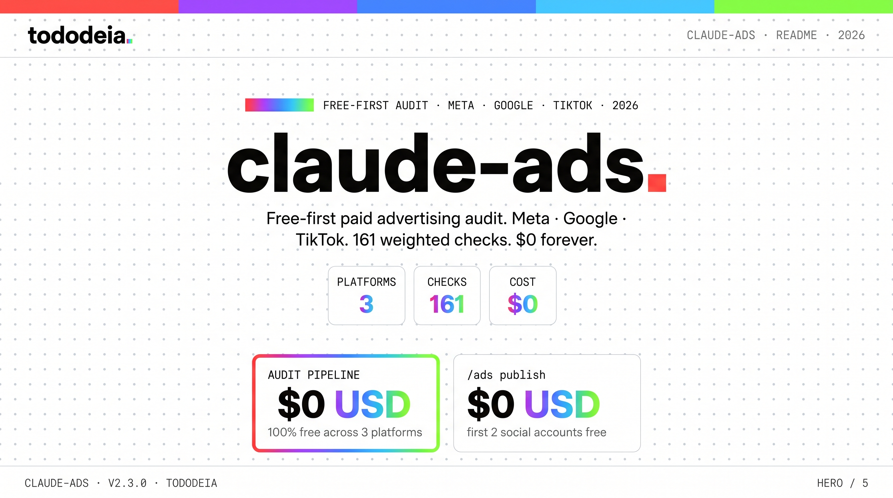
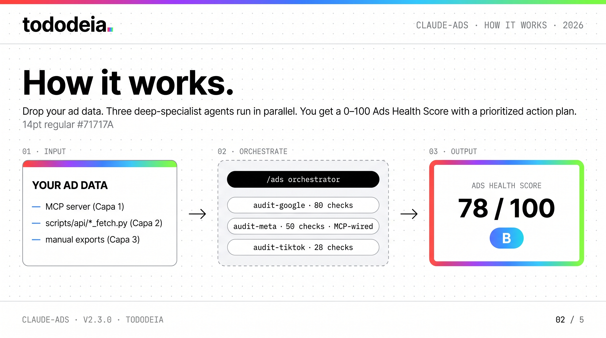
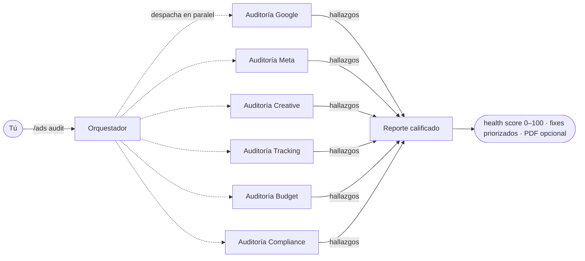
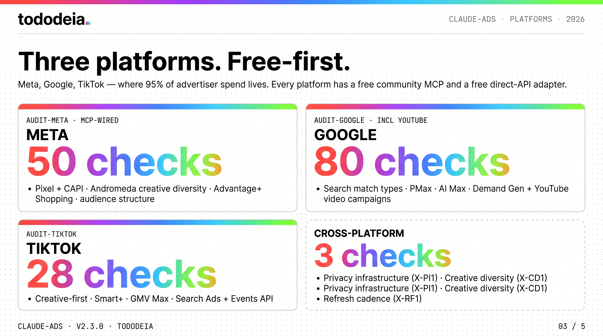
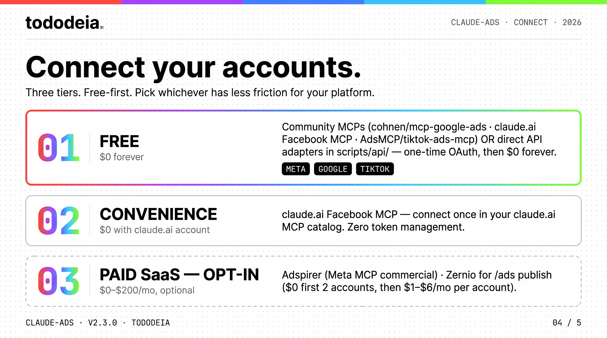
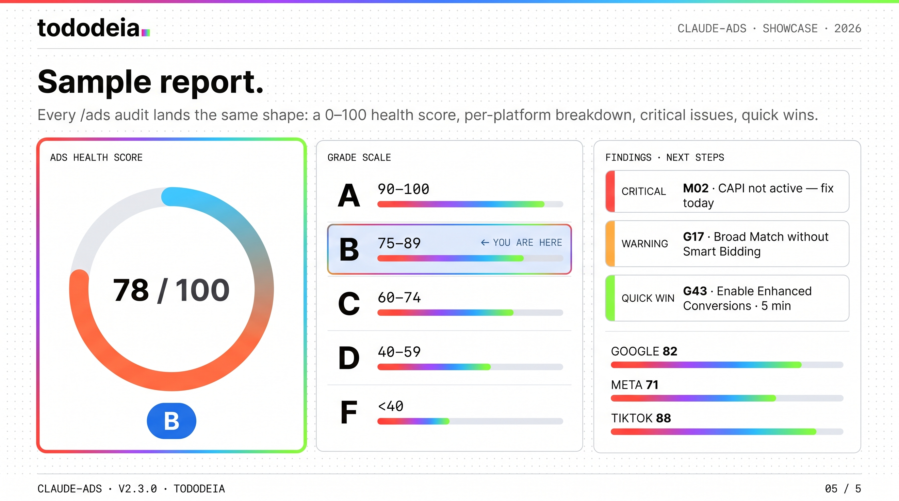

<div align="right">
<sub><a href="README.md">EN</a> · <strong>Español</strong></sub>
</div>

<p align="center">
  
</p>

# Claude Ads

> Un skill gratuito para Claude Code que convierte a Claude en tu equipo interno de ads pagados — audita, planea, califica y reporta.

[](https://tododeia.com)
[](https://instagram.com/soyenriquerocha)
[](LICENSE)
[](https://github.com/Hainrixz/claude-ads/releases)
[](https://claude.ai/claude-code)

---

## ¿Qué es esto? (en español sencillo)

¿Sabes que le puedes pedir a Claude que revise tu código? **Claude Ads es la misma idea, pero para publicidad pagada.** Lo instalas una vez y a Claude le hacen un trasplante de cerebro: ahora sabe **Meta, Google y TikTok Ads** a nivel estratega senior — las 3 plataformas donde vive el 95% del gasto en ads — con ~158 verificaciones específicas, 8 plantillas por industria, y la capacidad de entregarte un reporte de auditoría real al final. Free-first: las 3 plataformas tienen MCPs gratuitos comunitarios **y** adapters API directos gratis.

Le pasas tus datos de ads (un export, un screenshot, o pegas tus números directo en el chat), escribes un comando como `/ads audit`, y Claude despacha seis analistas en paralelo — uno por cada parte de tu cuenta. Te regresa un health score de 0–100, una lista priorizada de qué arreglar, y (si quieres) un reporte PDF pulido que le puedes pasar a un cliente.

No es un botón mágico que te corre las campañas. Es un revisor senior que vive dentro de tu terminal, sabe qué está roto antes que tú, y nunca olvida revisar las cosas aburridas (Consent Mode V2, CAPI, reglas de learning phase, kill thresholds). Y desde la v2.0+ se actualiza solo mes con mes para no quedarse desactualizado.

---

## Inicio rápido (en menos de 2 minutos)

**Instalación como plugin (recomendado)** — se registra como plugin nativo de Claude Code con auto-updates:

```shell
/plugin marketplace add Hainrixz/claude-ads
/plugin install claude-ads@tododeia-claude-ads
```

**O en una línea (Unix / macOS / Linux):**

```bash
curl -fsSL https://raw.githubusercontent.com/Hainrixz/claude-ads/main/install.sh | bash
```

**O en una línea (Windows PowerShell):**

```powershell
irm https://raw.githubusercontent.com/Hainrixz/claude-ads/main/install.ps1 | iex
```

Después abre Claude Code y corre tu primera auditoría:

```shell
claude
> /ads audit
```

Claude te va a preguntar tu industria, gasto mensual y qué plataformas incluir. Le contestas. Él hace el resto.

---

## Cómo funciona

<p align="center">
  
</p>



El orquestador (`/ads`) no intenta hacer todo solo. Despacha seis agentes especializados en paralelo — cada uno con su checklist, sus referencias cargadas on-demand (estilo RAG), y sus pesos de severidad. Sus hallazgos se fusionan en un único reporte calificado.

---

## Qué puedes correr

| Grupo | Comando | Qué hace |
|---|---|---|
| **Auditoría** | `/ads audit` | Auditoría multi-plataforma — 3 agentes en paralelo (Meta, Google, TikTok), reporte calificado |
| **Por plataforma** | `/ads google` | Google Ads (Search, PMax, Demand Gen, CTV, incluye YouTube video campaigns) — 80 checks |
| | `/ads meta` | Meta Ads (FB / IG / Advantage+) — 50 checks · MCP-wired a claude.ai Facebook |
| | `/ads tiktok` | TikTok Ads (Smart+, Shop, Symphony, GMV Max) — 28 checks |
| **Creative** | `/ads creative` | Auditoría de calidad creativa + detección de fatiga |
| | `/ads landing` | Revisión de landing pages para conversión |
| **Estrategia** | `/ads plan <tipo>` | Plan estratégico desde 12 plantillas por industria |
| | `/ads budget` | Revisión de asignación de presupuesto + estrategia de bidding |
| | `/ads competitor` | Inteligencia de competencia entre todas las plataformas |
| **Números** | `/ads math` | Calculadora PPC: CPA, ROAS, break-even, LTV:CAC, MER |
| | `/ads test` | Diseño de A/B test (hipótesis, sample size, duración) |
| **Output** | `/ads report` | Reporte PDF de auditoría para entregar a clientes |
| **Mantenimiento** | `/ads update <plataforma\|all>` | Refrescar referencias con cambios de los últimos 30 días (NUEVO en v2.0) |

---

## Plataformas cubiertas

<p align="center">
  
</p>

| Plataforma | Checks | Áreas clave |
|---|---|---|
| Google Ads | **80** | Match types · PMax · AI Max · Demand Gen · CTV · YouTube video campaigns |
| Meta Ads | **50** | Pixel + CAPI · diversidad creativa Andromeda · Advantage+ Shopping · estructura de audiencias |
| TikTok Ads | **28** | Creative-first · Smart+ · GMV Max · Search Ads · Events API |
| Apple Search Ads | **35+** | Estructura de campaña · CPPs · Maximize Conversions · AdAttributionKit |
| Multi-plataforma | **3** | Infra de privacidad · diversidad creativa · cadencia de refresh |
| **Total** | **~158 por plataforma + 3 multi-plataforma = 161** | con peso por severidad → Ads Health Score 0–100 |

> **¿Por qué estas tres?** Cubren ~95% del gasto en ads. Cada una tiene un MCP comunitario gratis y un adapter API directo gratis en este repo. Removidas en v2.3.0: Apple Ads (no existe MCP), LinkedIn Ads (barrera del partner program + MCPs solo pagos), Microsoft Ads (menor adopción), YouTube Ads (vive dentro de Google Ads — cubierto vía `/ads google`).

---

## Conecta tus cuentas reales de ads — tres tiers, gratis primero

<p align="center">
  
</p>

Por default, Claude Ads corre en **modo manual** — pegas exports, screenshots o números. Funciona en cualquier plan, cuesta $0, requiere cero setup. Todo lo demás es opt-in. Hay **tres tiers** de integración:

### Tier 1 — Gratis (recomendado para individuales, agencias solo, indies) — **$0**

Dos caminos completamente gratis para darle datos en vivo a claude-ads. Elige el que tenga menos fricción para tu plataforma:

1. **MCP servers comunitarios** — open-source, corren localmente. El mejor camino cuando existe uno para tu plataforma:

   | Plataforma | Servidor MCP | Coste |
   |---|---|---|
   | Meta | claude.ai Facebook MCP (conectar en catálogo MCP de claude.ai) ✓ ya cableado en `audit-meta` | $0 |
   | Meta | [`brijr/meta-mcp`](https://github.com/brijr/meta-mcp) (alt self-hosted) | $0 |
   | Google | [`cohnen/mcp-google-ads`](https://github.com/cohnen/mcp-google-ads) | $0 |
   | TikTok | [`AdsMCP/tiktok-ads-mcp-server`](https://github.com/AdsMCP/tiktok-ads-mcp-server) | $0 |

2. **API adapters directos** (NUEVO en v2.3.0) — scripts pure-stdlib en `scripts/api/` que llaman la Marketing API oficial de cada plataforma. **Setup OAuth una vez por plataforma, luego $0 para siempre.** Corre antes de invocar `/ads <platform>`:

   ```bash
   export META_ACCESS_TOKEN='...'
   python3 scripts/api/meta_fetch.py --account-id act_123 -o meta-data.json
   # Luego en Claude Code: /ads meta — el agente lee meta-data.json automáticamente.
   ```

   Setup completo por plataforma en [`scripts/api/README.md`](scripts/api/README.md). El tiempo de setup va de 5 min (Meta) a 1–3 días hábiles (Google developer-token approval) a variable (LinkedIn partner approval).

### Tier 2 — Conveniencia — **$0 con cuenta claude.ai**

El **claude.ai Facebook MCP** oficial técnicamente es Tier 1 (gratis), pero es el camino más fácil porque no manejas tokens — claude.ai se encarga de OAuth. Conecta "Facebook" una vez en tu catálogo MCP de claude.ai y el agente `audit-meta` lo encuentra solo.

### Tier 3 — SaaS Pagado (opt-in)

La mayoría no necesita este tier. Úsalo solo cuando:

- Quieras features extra de Meta que el MCP oficial no expone → **[Adspirer](https://www.adspirer.com)** (Meta MCP, comercial).
- Quieras **publicar** los creatives generados a 14+ redes sociales (el comando `/ads publish`) → **[Zernio](https://zernio.com)** es la única integración aquí. **Zernio no tiene nada que ver con el pipeline de auditoría** — es publicación post-creativo. **Las primeras 2 cuentas conectadas son gratis para siempre** (sin tarjeta de crédito); las agencias pagan $1–$6/mes por cada cuenta adicional. Así que `/ads publish` es Tier 1 (gratis) para usuarios solo / marca única y Tier 3 (pagado) solo cuando manejas 3+ cuentas sociales. Ver [`/ads publish`](#ads-publish--publica-creatives-a-redes-sociales-via-zernio-pagado-opcional) abajo.

### Ojo

El modo en vivo significa que Claude puede leer — y con algunos servidores MCP, **escribir** — sobre tus cuentas reales de ads. Empieza en modo solo-lectura, apúntalo a un sandbox o una cuenta de bajo gasto primero, y solo activa write-access después de varias corridas limpias. El walkthrough completo por plataforma vive en [`ads/references/mcp-integration.md`](ads/references/mcp-integration.md) y [`scripts/api/README.md`](scripts/api/README.md).

---

## Plantillas por industria

`/ads plan <tipo>` arma un plan estratégico completo desde una plantilla afinada para tu modelo de negocio — mix de plataformas, arquitectura de campañas, ángulos creativos, targeting, distribución de presupuesto y KPIs. Vienen 8 incluidas:

| Plantilla | Para qué sirve |
|---|---|
| `ecommerce` | DTC / ecom · Shopping / PMax · ROAS-driven · estacional |
| `ecommerce-creative` | Ecom con testing creativo agresivo |
| `local-service` | Plomeros, dentistas, agencias · Google Search + LSA · call tracking |
| `real-estate` | Inmobiliarias · Special Ad Category (housing) · campañas comprador/vendedor |
| `healthcare` | Clínicas / salud · HIPAA · LegitScript · targeting restringido |
| `finance` | Fintech / créditos · Special Ad Category · disclosures requeridos |
| `agency` | Manejo multi-cliente · framework de reporting |
| `generic` | Cuestionario universal cuando ninguna otra encaja |

> **Plantillas removidas en v2.3.0:** `saas`, `b2b-enterprise`, `info-products`, `mobile-app`. Sus estrategias dependían de LinkedIn, YouTube o Apple Ads — plataformas que claude-ads ya no audita tras el shift de foco a Meta / Google / TikTok. Para esas industrias, usa `generic` más los skills por plataforma.

---

## Showcase: cómo se ve un reporte de `/ads audit`

<p align="center">
  
</p>

Toda auditoría produce la misma estructura de salida, así tú (o tu cliente) siempre saben dónde buscar:

| Sección | Qué incluye |
|---|---|
| **Ads Health Score** | Un único número 0–100 (y letra A–F) que resume la cuenta |
| **Breakdown por plataforma** | Sub-scores por plataforma para ver dónde está sangrando la cuenta |
| **Issues críticos** | Violaciones duras (regla 3× kill, broad match sin smart bidding, falta CAPI) — estos van primero |
| **Quick wins** | Cosas que arreglas en menos de una hora con lift medible |
| **Recomendaciones estratégicas** | Movimientos a más largo plazo (cadencia de refresh creativo, restructura de cuenta) |
| **Flags de compliance** | Special Ad Categories (housing, employment, credit, financial products), status de Consent Mode V2 en EU |

| Letra | Score | Qué significa |
|---|---|---|
| **A** | 90–100 | Solo optimizaciones menores |
| **B** | 75–89 | Hay oportunidades de mejora |
| **C** | 60–74 | Issues notables que requieren atención |
| **D** | 40–59 | Problemas significativos presentes |
| **F** | <40 | Intervención urgente |

Corre `/ads report` después de cualquier auditoría para empacar los hallazgos en un PDF listo para cliente (gauge del health score, gráficas por plataforma, tablas formateadas, layout sin overlap).

---

## Integra los resultados en tu propio agente (NUEVO en v2.2.0)

Cada agente `audit-*` ahora escribe sus resultados en **dos formatos** en paralelo:

- **`<plataforma>-audit-results.md`** — reporte legible para humanos, lo que ve tu cliente.
- **`<plataforma>-audit-results.json`** — formato máquina, valida contra [`ads/references/audit-output-schema.json`](ads/references/audit-output-schema.json). Este es el contrato del que tu agente downstream puede depender.

Forma del JSON (abreviada):

```json
{
  "platform": "meta",
  "data_source": "mcp",
  "health_score": 78,
  "grade": "B",
  "category_scores": { "pixel_capi_health": { "score": 65, "weight": 0.3 }, ... },
  "checks": [
    { "id": "M02", "severity": "critical", "result": "WARNING",
      "finding": "CAPI activo pero EMQ de Purchase es 6.4 (objetivo ≥8.0)",
      "recommendation": "Envía email hasheado + teléfono vía CAPI Server Events",
      "fix_time_minutes": 30 }
  ],
  "quick_wins": [ ... ],
  "critical_issues": [ ... ]
}
```

Si estás cableando claude-ads a un agente más grande o dashboard, parsea el JSON, no el Markdown. El orchestrator (`/ads audit`) ya hace esto: valida el JSON de cada sub-auditoría contra el schema antes de agregar al Ads Health Score cross-platform, y falla rápido en errores de schema en lugar de combinar markdown parcial silenciosamente.

Para extender el pipeline con una nueva plataforma (Pinterest, Reddit, X, tu propia fuente interna): duplica [`ads/references/mcp-meta-integration.md`](ads/references/mcp-meta-integration.md), declara las herramientas MCP en el frontmatter del nuevo agente, haz el paso 1 del SKILL.md MCP-first, y emite JSON contra el schema compartido. El orchestrator, scoring y reports siguen funcionando sin cambios — ese es el punto del contrato.

---

## `/ads publish` — Publica creatives a redes sociales via Zernio (pagado opcional)

**Las primeras 2 cuentas conectadas son gratis para siempre, sin tarjeta de crédito.** Usuario solo publicando a Instagram + Facebook = $0/mes. Las agencias que manejan 3+ cuentas pagan $1–$6/mes por cada cuenta adicional (ver [zernio.com/pricing](https://zernio.com/pricing) para la calculadora en vivo). La única letra chica: los costos de X/Twitter API son pass-through a las tarifas de X aún en el tier gratis; las otras 13 redes están incluidas full.

Después de que `/ads generate` o `/ads photoshoot` produzcan un directorio `ad-assets/`, puedes cerrar el loop publicando esos assets directo a 14+ redes sociales: Twitter/X · Instagram · Facebook · LinkedIn · TikTok · YouTube · Pinterest · Reddit · Bluesky · Threads · Google Business · Telegram · Snapchat · WhatsApp · Discord.

```bash
# Una vez: setup Zernio (signup gratis para ≤2 cuentas)
export ZERNIO_API_KEY='sk_...'

# Plan sin publicar (siempre gratis, sin auth)
/ads publish --dry-run

# Publicación real (gratis para tus primeras 2 cuentas conectadas)
/ads publish instagram facebook --schedule 2026-05-13T09:00:00Z
```

El skill lee `campaign-brief.md` para extraer captions por plataforma (busca `## Instagram caption`, `## TikTok caption`, etc.), matchea cada asset con plataformas compatibles por aspect ratio (`9x16` → Stories/Reels/Shorts/TikTok; `1x1` → Feeds; `16x9` → YouTube/X), y llama a Zernio. Zernio maneja el OAuth por red social (conectas Twitter/Meta/LinkedIn una vez adentro de Zernio, nunca lidias con sus tokens directos).

**Para creators solos y operadores single-brand, `/ads publish` es 100% gratis.** Solo las agencias que manejan 3+ cuentas de clientes entran en tier pagado ($6/mes por cuenta en el rango 3–10, baja a $3 sobre 10, $1 sobre 100). Si prefieres no pagar, `/ads publish --dry-run` igual te da la matriz de plan (qué asset va dónde, con qué caption) para que publiques manualmente con el scheduler nativo de cada plataforma (Meta Business Suite, composer de LinkedIn, TikTok Business Suite — todos gratis).

Detalles completos: [`skills/ads-publish/SKILL.md`](skills/ads-publish/SKILL.md).

---

## `/ads update` — manteniendo el skill al día

Las plataformas de ads sacan cambios en su API, features nuevas y deprecations casi cada semana. Tu auditoría es tan buena como sus datos de referencia. **`/ads update <plataforma|all>` regenera los archivos de referencia por plataforma** con los últimos 30 días de cambios desde changelogs oficiales (Google, Meta, TikTok), discusión de practitioners (r/PPC, r/GoogleAds, r/FacebookAds, r/TikTokAds, Hacker News) y prensa de la industria (Search Engine Land, AdWeek, MarTech) vía WebSearch como fallback.

El pipeline está adaptado de [last30days-skill](https://github.com/mvanhorn/last30days-skill) (MIT, por Matt Van Horn — ver [`scripts/lib/THIRD_PARTY_NOTICES.md`](scripts/lib/THIRD_PARTY_NOTICES.md)).

| Modo | Costo aprox. | Cadencia recomendada |
|---|---|---|
| `/ads update <una plataforma>` | 50–150k tokens | Mensual por plataforma |
| `/ads update all` | 500k+ tokens | Mensual, en horario de bajo tráfico |

`/ads update` siempre pide confirmación y muestra el costo estimado antes de correr — puedes cancelar o caer al modo `--depth quick`. Si tu plan de créditos es ajustado, prefiere modo por-plataforma, corre mensual (no diario) y elige Sonnet sobre Opus para esta corrida. Los datos de referencia siguen válidos ~30 días; correrlo diario quema créditos sin output diferente.

Detalles completos: [`skills/ads-update/SKILL.md`](skills/ads-update/SKILL.md).

---

## Qué cambia este fork

Este es un fork comunitario de [tododeia.com](https://tododeia.com) basado en el proyecto open-source `claude-ads` (MIT). Resumen honesto de 30 segundos sobre qué es realmente diferente:

- **Foco en 3 plataformas base (NUEVO en v2.3.0)** — Meta, Google, TikTok. El upstream cubría 7 plataformas; este fork quita Apple, LinkedIn, Microsoft y YouTube como first-class porque (a) Apple no tiene MCP, (b) LinkedIn requiere partner-program approval, (c) Microsoft tiene menor adopción, (d) los checks de YouTube ya viven dentro de `/ads google` (Google Ads API compartida). Posicionamiento más afilado, menos mantenimiento, cada plataforma sobreviviente es genuinamente gratis.
- **Hybrid MCP + API (NUEVO en v2.3.0)** — tres tiers gratis por plataforma: MCP comunitario (Capa 1), adapter API directo en `scripts/api/` (Capa 2), exports manuales (Capa 3). Elige el que tenga menos fricción.
- **`/ads publish` (NUEVO en v2.3.0)** — publicación opcional pagada de creatives generados a 14+ redes sociales vía Zernio. **Primeras 2 cuentas conectadas gratis para siempre**, sin tarjeta. Solo / single-brand = $0.
- **Refactor de bases (v2.2.0)** — contrato JSON al que toda auditoría se conforma, MCP oficial de **claude.ai Facebook** cableado en `audit-meta`, suite de tests automatizada (`pytest tests/`, corre en CI), reference files split en sub-files (todos ≤200 líneas), metodología compartida 7-pasos, frontmatter estandarizado. Mismos comandos, cero breaking changes.
- **`/ads update` (v2.0)** — conocimiento de plataforma auto-refrescante con pipeline vendoreado de research time-bounded. El upstream no se actualizaba solo; este fork sí.
- **Mantenimiento, identidad y rebrand visual** — bug fixes, branding tododeia, este README.

El proyecto upstream proveyó las checks originales, sub-skills, agentes, guía de integración MCP y todo el pipeline de auditoría/scoring/reporting — el crédito va al maintainer original. Ver [`CHANGELOG.md`](CHANGELOG.md) para la historia completa.

---

## Privacidad y manejo de datos

- **Ejecución local.** Claude Ads corre completamente dentro de tu sesión local de Claude Code. No se manda data de cuentas de ads a tododeia, al autor original ni a ningún servidor de terceros.
- **Sin credenciales en el repo.** Las credenciales de MCP viven en tu propio `~/.claude/.mcp.json`, nunca en el skill.
- **Fetches de URL validados contra SSRF.** El análisis de landing pages bloquea IPs privadas y valida URLs antes de fetch ([`scripts/url_utils.py`](scripts/url_utils.py)).
- **Llamadas de salida de `/ads update`.** Este comando hace llamadas HTTP a internet público (Reddit JSON, Hacker News Algolia, páginas de changelog oficiales, WebSearch) para juntar cambios — nada de tu data de ads sale en esas llamadas.

---

## Preguntas frecuentes

**¿Claude Ads se mete a mi ad manager solito?**
No por default — analiza la data que tú le pases. Si quieres acceso en vivo, instala el servidor MCP que corresponda (ver [Conecta tus cuentas reales de ads](#conecta-tus-cuentas-reales-de-ads)).

**¿Puede crear o editar ads por mí?**
Aún con un servidor MCP con permisos de escritura conectado, Claude Ads se posiciona como herramienta de auditoría + estrategia: encuentra issues, recomienda fixes, arma planes de campaña. Si quieres que efectivamente escriba cambios a tu cuenta es decisión tuya y se activa por MCP — no viene prendido por default.

**¿Qué tan frescos son los benchmarks y reglas de plataforma?**
Las referencias built-in las cura el maintainer. `/ads update` refresca los changelogs por plataforma mensualmente con los últimos 30 días de cambios. Córrelo mensual para mantenerte al día.

**Mi cuenta es chica — ¿siguen aplicando estos benchmarks?**
Dile a Claude tu gasto mensual desde el principio. *"Gasto $2k/mes en Google Ads para un negocio local de plomería"* da resultados mucho mejores que correr `/ads google` en frío. Los benchmarks cambian un montón entre cuentas de $500/mes y $50k/mes.

**¿`/ads update all` me va a tronar los créditos?**
Puede — ver la [tabla de costos de `/ads update`](#ads-update--manteniendo-el-skill-al-día). Usa modo por-plataforma si andas justo de presupuesto, corre mensual no diario, elige Sonnet sobre Opus para la corrida.

**¿Qué plataformas no están cubiertas?**
First-class auditoría: **Meta · Google · TikTok** (YouTube video campaigns están cubiertas vía `/ads google` porque comparten Google Ads API). Removidas en v2.3.0: Apple Ads (no existe MCP), LinkedIn Ads (barrera partner-program), Microsoft Ads (menor adopción), YouTube standalone (ahora dentro de Google). Para planeación estratégica únicamente, `/ads plan` aún referencia LinkedIn/YouTube en su template `generic`. Reddit, CTV/OTT, Pinterest y Snapchat siguen sin soporte.

---

## Requisitos

- Claude Code CLI
- Python 3.10+
- Playwright (opcional, para análisis de landing pages en vivo)
- reportlab (opcional, para generación de PDF en `/ads report`)

---

## Desinstalar

```bash
# Unix / macOS / Linux
curl -fsSL https://raw.githubusercontent.com/Hainrixz/claude-ads/main/uninstall.sh | bash
```

```powershell
# Windows PowerShell
irm https://raw.githubusercontent.com/Hainrixz/claude-ads/main/uninstall.ps1 | iex
```

---

## Créditos

Mantenido por [**tododeia.com**](https://tododeia.com) · Enrique Henry · [@soyenriquerocha](https://instagram.com/soyenriquerocha).

Originalmente basado en el proyecto open-source `claude-ads` (MIT). El pipeline de research time-bounded vendoreado que potencia `/ads update` está adaptado de [last30days-skill](https://github.com/mvanhorn/last30days-skill) (MIT, por Matt Van Horn) — ver [`scripts/lib/THIRD_PARTY_NOTICES.md`](scripts/lib/THIRD_PARTY_NOTICES.md).

## Licencia

MIT — ver [LICENSE](LICENSE).
