# claude-ads

> The only multi-platform paid-advertising audit skill for Claude Code that updates itself.

[](https://tododeia.com)
[](https://instagram.com/soyenriquerocha)
[](LICENSE)
[](https://github.com/Hainrixz/claude-ads/releases)
[](https://claude.ai/claude-code)

Comprehensive paid advertising audit and optimization skill for Claude Code. Covers Google Ads, Meta Ads, YouTube Ads, LinkedIn Ads, TikTok Ads, Microsoft Ads, and Apple Ads with **250+ audit checks**, industry-specific templates, parallel subagent delegation, PPC financial modeling, A/B test design, PDF report generation, and — new in v2.0 — **`/ads update`**, a self-refreshing knowledge layer that pulls the last 30 days of platform changes (features, deprecations, policy updates) directly from Reddit, Hacker News, official changelogs, and the open web.

## Contents

- [Installation](#installation)
- [Demo](#demo)
- [Quick Start](#quick-start)
- [Cost & Credits](#cost--credits)
- [Commands](#commands)
- [Features](#features)
- [Architecture](#architecture)
- [How It Analyzes Your Ads](#how-it-analyzes-your-ads)
- [FAQ](#faq)
- [Requirements](#requirements)
- [Uninstall](#uninstall)
- [About](#about)
- [License](#license)

## Installation

### Plugin Install (Recommended)

Add the marketplace and install in Claude Code:

```shell
/plugin marketplace add Hainrixz/claude-ads
/plugin install claude-ads@tododeia-claude-ads
```

This registers claude-ads as a native plugin with auto-updates, namespace isolation, and proper version tracking.

### One-Command Install (Unix/macOS/Linux)

```bash
curl -fsSL https://raw.githubusercontent.com/Hainrixz/claude-ads/main/install.sh | bash
```

### One-Command Install (Windows PowerShell)

```powershell
irm https://raw.githubusercontent.com/Hainrixz/claude-ads/main/install.ps1 | iex
```

### Manual Install

```bash
git clone https://github.com/Hainrixz/claude-ads.git
cd claude-ads
./install.sh          # Unix/macOS/Linux
```

```powershell
.\install.ps1         # Windows PowerShell
```

<p align="center">
  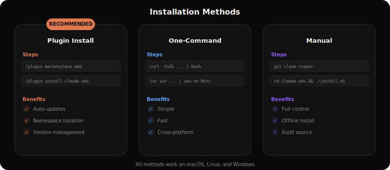
</p>

## Demo

<p align="center">
  
</p>

## Quick Start

```bash
# Start Claude Code
claude

# Run a full multi-platform audit
/ads audit

# Deep analysis for a single platform
/ads google
/ads meta
/ads linkedin

# Strategic planning by business type
/ads plan saas
/ads plan ecommerce
/ads plan local-service

# Cross-platform creative audit
/ads creative

# Budget and bidding strategy review
/ads budget

# NEW in v2.0 — refresh platform references with last 30 days of changes
/ads update meta
/ads update all
```

<p align="center">
  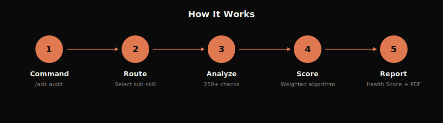
</p>

## Cost & Credits

> **Heads up — `/ads update` is the most credit-intensive command in this skill.**

The new `/ads update` command runs 20–50 web fetches per platform plus LLM synthesis to digest what's actually changed in the last 30 days across Reddit, Hacker News, official platform changelogs, and the open web.

| Mode | Estimated cost | Recommended cadence |
|---|---|---|
| `/ads update <one platform>` | ~50–150k tokens per run | Monthly per platform |
| `/ads update all` | ~500k+ tokens per run | Monthly, off-peak |

**If you're on a low-credit plan**, run `update` per platform instead of `all`, switch to Sonnet (not Opus) for the run, and refresh **monthly — not daily**. Reference data stays valid for ~30 days; daily reruns waste credits without producing meaningfully different output.

The skill prompts for confirmation before any `/ads update` invocation and shows the estimated cost — you can always cancel or fall back to a lighter `--depth quick` mode.

All other `/ads` commands (audit, platform deep-dives, creative pipeline, math, test, report) cost the same as in v1.x — no change.

## Commands

| Command | Description |
|---------|-------------|
| `/ads audit` | Full multi-platform audit with parallel subagent delegation |
| `/ads google` | Google Ads deep analysis (Search, PMax, Display, YouTube, Demand Gen) |
| `/ads meta` | Meta Ads deep analysis (FB, IG, Advantage+ Shopping) |
| `/ads youtube` | YouTube Ads specific analysis (Skippable, Shorts, Demand Gen) |
| `/ads linkedin` | LinkedIn Ads deep analysis (B2B, Lead Gen, TLA) |
| `/ads tiktok` | TikTok Ads deep analysis (Creative, Shop, Smart+) |
| `/ads microsoft` | Microsoft/Bing Ads deep analysis (Copilot, Import validation) |
| `/ads apple` | Apple Ads deep analysis (campaign structure, bids, CPPs, Maximize Conversions, TAP) |
| `/ads creative` | Cross-platform creative quality audit and fatigue detection |
| `/ads landing` | Landing page quality assessment for ad campaigns |
| `/ads budget` | Budget allocation and bidding strategy review |
| `/ads plan <type>` | Strategic ad plan with industry templates |
| `/ads competitor` | Competitor ad intelligence across all platforms |
| `/ads math` | PPC financial calculator (CPA, ROAS, break-even, budget forecasting, LTV:CAC) |
| `/ads test` | A/B test design (hypothesis framework, significance, sample size, duration) |
| `/ads report` | Generate PDF audit report for client deliverables |
| `/ads update <platform\|all>` | **NEW** — refresh platform references with last 30 days of changes (see [Cost & Credits](#cost--credits)) |

### `/ads audit`
**Full Multi-Platform Audit**

Spawns 6 parallel subagents to analyze your ad accounts simultaneously:
- **audit-google**: 80 checks across Search, PMax, AI Max, Demand Gen, CTV, YouTube
- **audit-meta**: 50 checks across Pixel/CAPI, Andromeda creative diversity, Structure, Audience
- **audit-creative**: 21+ cross-platform creative quality checks with Andromeda and Symphony awareness
- **audit-tracking**: 8+ conversion tracking and privacy infrastructure checks (Consent Mode V2, CAPI, Events API, AdAttributionKit)
- **audit-budget**: 24 budget and bidding strategy checks
- **audit-compliance**: 18+ compliance checks (ECPC deprecated, VAC deprecated, EU messaging, Apple rebrand)

Generates a unified **Ads Health Score (0-100)** with prioritized action plan.

<p align="center">
  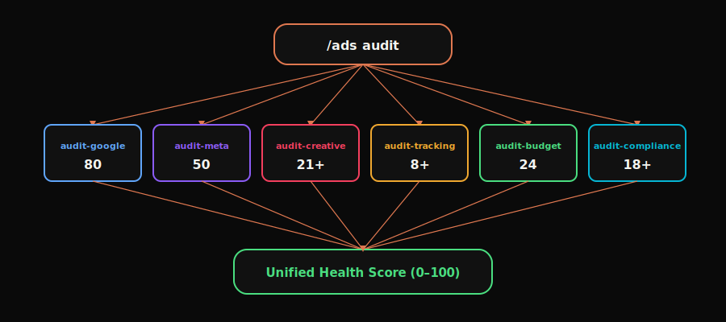
</p>

<p align="center">
  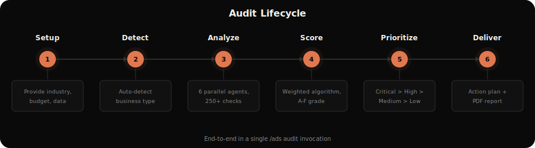
</p>

### `/ads update <platform|all>` (NEW in v2.0)

**Self-refreshing platform knowledge.** Ad platforms ship API changes, deprecations, and new features almost weekly — your audit is only as good as your reference data. `/ads update` regenerates the per-platform reference files in `ads/references/<platform>-changelog-30d.md` (and appends a "Recent Updates" block to `ads/references/<platform>-audit.md`) by aggregating the last 30 days of changes from:

- **Official platform changelogs** (Google Ads release notes, Meta Marketing API changelog, TikTok / LinkedIn / Microsoft / Apple Ads release pages)
- **Practitioner discussion** (r/PPC, r/GoogleAds, r/FacebookAds, r/TikTokAds, r/LinkedInAds, r/adops, Hacker News)
- **Industry press** (Search Engine Land, Search Engine Journal, AdWeek, MarTech) via WebSearch fallback

Powered by an adapted version of the time-bounded research pipeline from [last30days-skill](https://github.com/mvanhorn/last30days-skill) (MIT, by Matt Van Horn — see `scripts/lib/THIRD_PARTY_NOTICES.md`).

**See the [Cost & Credits](#cost--credits) section before running.**

### `/ads plan <business-type>`
**Strategic Ad Planning**

Industry-specific templates with platform mix, campaign architecture, creative strategy, targeting, budget guidelines, and KPI targets.

**Supported business types:**
- `saas`: Trial/demo focus, Google + LinkedIn primary
- `ecommerce`: Shopping/PMax, ROAS-focused, seasonal
- `local-service`: Google Search + LSA, call tracking, geo radius
- `b2b-enterprise`: LinkedIn ABM, long sales cycle, pipeline metrics
- `info-products`: Meta + YouTube, webinar/VSL funnels
- `mobile-app`: Meta + Google UAC, MMP required, LTV:CPI
- `real-estate`: Special Ad Category (housing), buyer/seller campaigns
- `healthcare`: HIPAA compliance, LegitScript, restricted targeting
- `finance`: Special Ad Category (credit), required disclosures
- `agency`: Multi-client management, reporting framework
- `generic`: Universal template with platform selection questionnaire

<p align="center">
  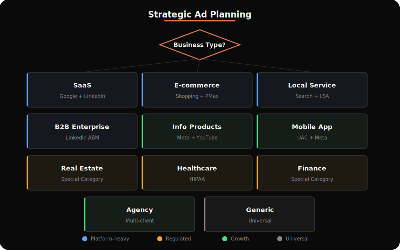
</p>

### `/ads math` and `/ads test`

<p align="center">
  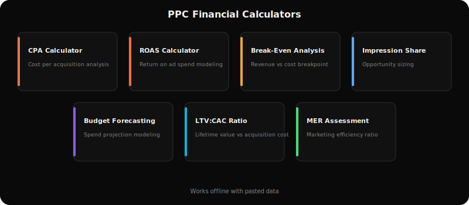
  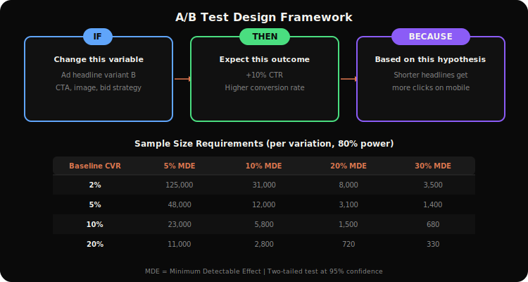
</p>

### `/ads report`

Generate professional PDF audit reports for client deliverables with health score gauge, platform comparison charts, pass/fail distribution, formatted tables, and zero-overlap layout.

<p align="center">
  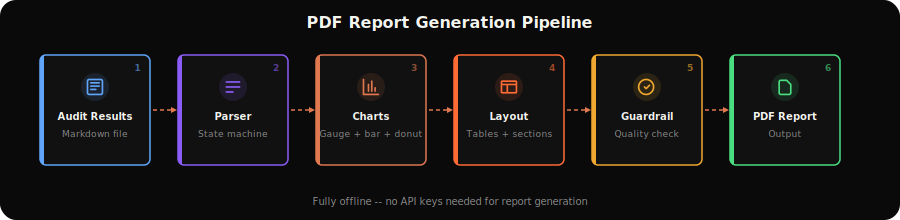
</p>

## Features

### 250+ Audit Checks
Comprehensive coverage across all platforms with weighted severity scoring:

| Platform | Checks | Key Areas |
|----------|--------|-----------|
| Google Ads | 80 | Search, PMax, AI Max, Demand Gen, CTV, YouTube |
| Meta Ads | 50 | Pixel/CAPI, Andromeda creative diversity, Structure, Audience |
| LinkedIn Ads | 27 | B2B targeting, TLA, Lead Gen, CRM integration |
| TikTok Ads | 28 | Creative-first, Smart+, GMV Max, Search Ads, Events API |
| Microsoft Ads | 24 | Google import safety, Copilot, CTV, LinkedIn targeting, video |
| Apple Ads | 35+ | Campaign structure, CPPs, Maximize Conversions, AdAttributionKit |
| Cross-platform | 3 | Privacy infrastructure, creative diversity, refresh cadence |

<p align="center">
  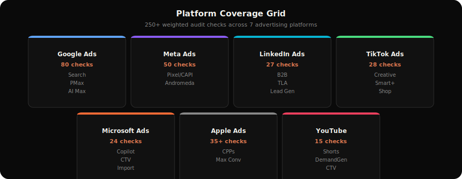
</p>

<p align="center">
  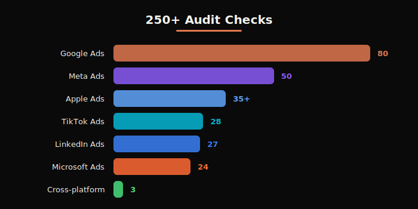
</p>

### Self-Updating References (NEW in v2.0)

Ad platforms move fast. The seven `ads/references/<platform>-audit.md` files ship with curated checks, but `/ads update` keeps them current by digesting the last 30 days of changes per platform — official changelogs, practitioner discussion, and industry press — into dated `ads/references/<platform>-changelog-30d.md` files. Run monthly to stay current without re-cloning.

### Ads Health Score (0-100)
Weighted scoring algorithm with severity multipliers:

| Grade | Score | Action Required |
|-------|-------|-----------------|
| A | 90-100 | Minor optimizations only |
| B | 75-89 | Some improvement opportunities |
| C | 60-74 | Notable issues need attention |
| D | 40-59 | Significant problems present |
| F | <40 | Urgent intervention required |

<p align="center">
  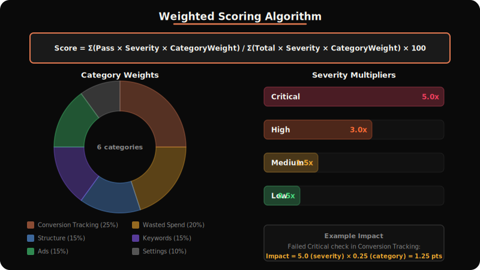
</p>

### Industry Detection
Auto-detects business type from ad account signals (product feeds, conversion events, platform mix, targeting patterns) and loads industry-specific benchmarks and templates.

### Quality Gates
Hard rules enforced during every audit:
- Never recommend Broad Match without Smart Bidding (Google)
- 3x Kill Rule: flag CPA >3x target for immediate pause
- Budget sufficiency: Meta >=5x CPA/ad set, TikTok >=50x CPA/ad group
- Learning phase protection: no edits during active learning
- Compliance: auto-check Special Ad Categories (housing/credit/finance)
- **Privacy infrastructure gate**: verify tracking stack (Consent Mode V2, CAPI, Events API, AdAttributionKit) before optimization recommendations
- **Andromeda creative diversity**: flag Meta accounts with <10 genuinely distinct creatives

<p align="center">
  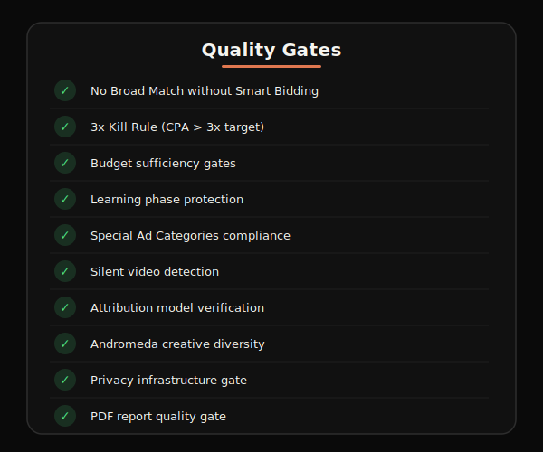
</p>

### Creative Pipeline

AI-powered creative generation with 4 specialized agents:

<p align="center">
  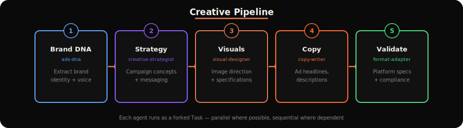
</p>

### Reference Data
25 built-in reference files with 2026-current benchmarks, bidding decision trees, platform specifications, compliance requirements, conversion tracking guides, MCP integration guide, and additional platform coverage. Plus 7 auto-generated `<platform>-changelog-30d.md` files via `/ads update`.

### Data Handling & Privacy
claude-ads runs entirely on your local machine via Claude Code. No ad account data is sent to external servers. When using MCP servers for live API access, data flows directly between your machine and the ad platform APIs. All analysis happens locally. `/ads update` does make outbound HTTP requests to public sources (Reddit JSON API, Hacker News Algolia API, official platform changelog pages, WebSearch) — none of your ad data is sent during these calls.

<p align="center">
  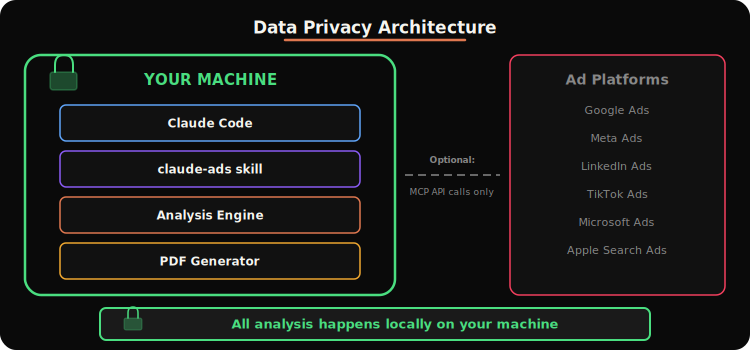
</p>

## Architecture

<p align="center">
  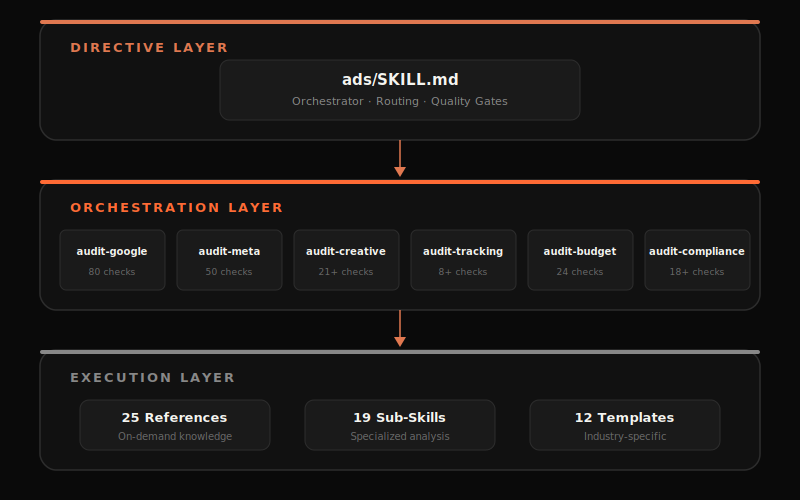
</p>

```
~/.claude/skills/ads/              # Main orchestrator
~/.claude/skills/ads/references/   # 25 RAG reference files + 7 auto-generated changelogs
~/.claude/skills/ads-*/            # 20 sub-skills (19 original + ads-update)
~/.claude/skills/ads-plan/assets/  # 12 industry templates
~/.claude/agents/                  # 10 agents (6 audit + 4 creative)
```

### How It Works

1. **Orchestrator** (`/ads`) routes commands to specialized sub-skills
2. **Sub-skills** provide deep single-domain analysis with structured output
3. **Agents** run in parallel during full audits for maximum speed
4. **References** load on-demand (RAG pattern); only what's needed per analysis
5. **Templates** provide industry-specific strategy frameworks
6. **`/ads update`** regenerates per-platform reference data from live sources (NEW in v2.0)

## How It Analyzes Your Ads

**claude-ads works with data you provide**; exports, screenshots, or pasted metrics from your ad platform dashboards. It does not connect to any ad platform API automatically.

**To get accurate, account-specific recommendations:**
1. Export your account data (last 30 days recommended)
2. Run the relevant command: `/ads google`, `/ads audit`, etc.
3. Claude will ask for your industry and budget context first; provide these for relevant benchmarks
4. Paste or share your data when prompted

<p align="center">
  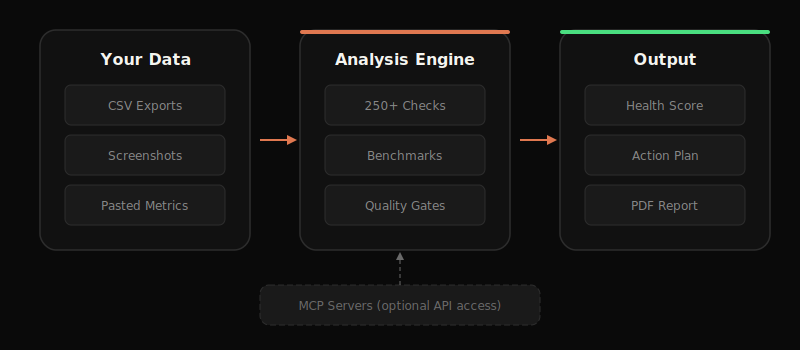
</p>

### Live Data Integration (Optional)

For direct API access without manual exports, pair claude-ads with MCP servers. See `ads/references/mcp-integration.md` for setup guides:
- **Google Ads**: [mcp-google-ads](https://github.com/cohnen/mcp-google-ads): 29 GAQL tools for live API access
- **Meta Ads**: [Adspirer MCP](https://www.adspirer.com) or use included `scripts/fetch_meta_ads.py`
- **LinkedIn Ads**: [GrowthSpree MCP](https://www.growthspreeofficial.com) or [Adzviser MCP](https://adzviser.com)

<p align="center">
  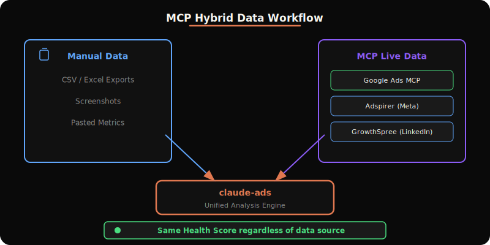
</p>

## FAQ

**Can claude-ads log into my ad manager automatically?**
No. claude-ads analyzes data you provide (exports, screenshots, or pasted metrics). It doesn't connect to ad platforms automatically. See the Live Data Integration section above for Google Ads API access via MCP.

**Does it use real account data or generic benchmarks?**
Benchmarks are based on industry research covering 16,000+ campaigns. They're averages; your results will vary by industry, budget level, and account maturity. Always provide your industry and monthly spend when running audits for the most relevant comparisons.

**How fresh is the platform reference data?**
Built-in references are curated by the maintainer. The new `/ads update` command refreshes per-platform changelogs with the last 30 days of changes from Reddit, Hacker News, and official sources. Run it monthly to stay current.

**Is ad posting or campaign creation still manual?**
Yes. claude-ads is an audit and strategy tool. It finds issues, recommends fixes, and builds campaign plans; but creating, editing, or posting ads remains manual in your ad platform.

**Why do some recommendations seem off for my account size?**
Benchmarks and best practices differ significantly between a $500/month account and a $50k/month account. Always tell Claude your budget upfront: *"I spend $2k/month on Google Ads for a local plumbing business"* gives much better results than running `/ads google` without context.

**Does it support [platform] ads?**
Currently supported: Google, Meta (Facebook/Instagram), YouTube, LinkedIn, TikTok, Microsoft/Bing, and Apple Ads. Additional platforms (Reddit, CTV/OTT, Pinterest, Snapchat) are covered in the reference guide for strategic planning.

**Will `/ads update all` burn through my credits?**
It can — see the [Cost & Credits](#cost--credits) section. Use per-platform mode (`/ads update meta`) on a low-credit plan, run monthly not daily, and pick Sonnet over Opus for the run.

## Requirements

- Claude Code CLI
- Python 3.10+ with Playwright (optional, for live landing page analysis)
- reportlab (optional, for PDF report generation via `/ads report`)

## Uninstall

### Unix/macOS/Linux

```bash
curl -fsSL https://raw.githubusercontent.com/Hainrixz/claude-ads/main/uninstall.sh | bash
```

### Windows PowerShell

```powershell
irm https://raw.githubusercontent.com/Hainrixz/claude-ads/main/uninstall.ps1 | iex
```

## About

This is a community fork maintained by [**tododeia.com**](https://tododeia.com). Follow on Instagram: [**@soyenriquerocha**](https://instagram.com/soyenriquerocha).

Originally based on the open-source `claude-ads` project (MIT). The vendored time-bounded research pipeline that powers `/ads update` is adapted from [last30days-skill](https://github.com/mvanhorn/last30days-skill) (MIT, by Matt Van Horn) — see `scripts/lib/THIRD_PARTY_NOTICES.md` for full attribution.

## License

MIT License — see [LICENSE](LICENSE) for details.
