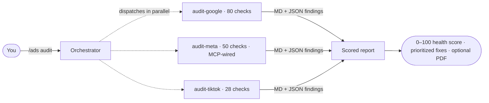

<div align="right">
<sub><strong>EN</strong> · <a href="README.es.md">Español</a></sub>
</div>

<p align="center">
  
</p>

# Claude Ads

> A free Claude Code skill that turns Claude into your in-house paid-ads team — audits, plans, scores, reports.

[](https://tododeia.com)
[](https://instagram.com/soyenriquerocha)
[](LICENSE)
[](https://github.com/Hainrixz/claude-ads/releases)
[](https://claude.ai/claude-code)

---

## What is this? (in plain English)

You know how you can ask Claude to review your code? **Claude Ads is the same idea, but for paid advertising.** Install it once, and Claude gets a brain transplant: it now knows **Meta, Google, and TikTok Ads** at a senior-strategist level — the 3 platforms where 95% of advertiser spend lives — with ~158 specific checks, 8 industry templates, and the ability to write you a real audit report at the end. Free-first: all 3 platforms have free community MCPs **and** free direct-API adapters.

You drop in your ad data (an export, a screenshot, or just paste your numbers), type a command like `/ads audit`, and Claude runs six analysts in parallel — one per slice of your account. You get back a 0–100 health score, a prioritized punch list of what to fix, and (optionally) a polished PDF report you can hand a client.

It's not a magic button that runs your ads for you. It's a senior-level reviewer that lives inside your terminal, knows what's broken before you do, and never forgets to check the boring things (Consent Mode V2, CAPI, learning-phase rules, kill thresholds). And in v2.0+, it can update its own knowledge base monthly so it doesn't go stale.

---

## Quick start (90 seconds)

**Plugin install (recommended)** — registers as a native Claude Code plugin with auto-updates:

```shell
/plugin marketplace add Hainrixz/claude-ads
/plugin install claude-ads@tododeia-claude-ads
```

**Or one-liner install (Unix / macOS / Linux):**

```bash
curl -fsSL https://raw.githubusercontent.com/Hainrixz/claude-ads/main/install.sh | bash
```

**Or one-liner install (Windows PowerShell):**

```powershell
irm https://raw.githubusercontent.com/Hainrixz/claude-ads/main/install.ps1 | iex
```

Then open Claude Code and run your first audit:

```shell
claude
> /ads audit
```

Claude will ask you for your industry, monthly spend, and which platforms to include. Tell it. It does the rest.

---

## How it works

<p align="center">
  
</p>



The orchestrator (`/ads`) doesn't try to do everything itself. It dispatches **three deep-specialist agents in parallel** — one per platform (`audit-google`, `audit-meta`, `audit-tiktok`), each with its own checklist (G\* / M\* / T\* prefixed), its own reference data loaded on-demand (RAG style), and its own severity weights. Each agent emits both a human-readable Markdown report **and** a machine-readable JSON file validated against [`audit-output-schema.json`](ads/references/audit-output-schema.json). The orchestrator merges them into a single 0–100 Ads Health Score.

---

## What you can run

| Group | Command | What it does |
|---|---|---|
| **Audit** | `/ads audit` | Full multi-platform audit — 3 parallel agents (Meta, Google, TikTok), scored report |
| **Platform deep-dive** | `/ads google` | Google Ads (Search, PMax, Demand Gen, CTV, includes YouTube video campaigns) — 80 checks |
| | `/ads meta` | Meta Ads (FB / IG / Advantage+) — 50 checks · MCP-wired to claude.ai Facebook |
| | `/ads tiktok` | TikTok Ads (Smart+, Shop, Symphony, GMV Max) — 28 checks |
| **Creative** | `/ads creative` | Cross-platform creative quality + fatigue detection |
| | `/ads landing` | Landing page conversion review |
| **Strategy** | `/ads plan <type>` | Strategic plan from 8 industry templates |
| | `/ads budget` | Budget allocation + bidding strategy review |
| | `/ads competitor` | Competitor ad intelligence across all platforms |
| **Numbers** | `/ads math` | PPC calculator: CPA, ROAS, break-even, LTV:CAC, MER |
| | `/ads test` | A/B test design (hypothesis, sample size, duration) |
| **Output** | `/ads report` | PDF audit report for client deliverables |
| **Maintenance** | `/ads update <platform\|all>` | Refresh references with last-30-day platform changes (NEW in v2.0) |

---

## Platforms covered

<p align="center">
  
</p>

| Platform | Checks | Focus areas |
|---|---|---|
| Google Ads | **80** | Search match types · PMax · AI Max · Demand Gen · CTV · YouTube video campaigns |
| Meta Ads | **50** | Pixel + CAPI · Andromeda creative diversity · Advantage+ Shopping · audience structure |
| TikTok Ads | **28** | Creative-first · Smart+ · GMV Max · Search Ads · Events API |
| Cross-platform | **3** | Privacy infra · creative diversity · refresh cadence |
| **Total** | **~158 platform + 3 cross-platform = 161** | weighted by severity into a 0–100 Ads Health Score |

> **Why these three?** They cover ~95% of advertiser spend. Each has a free community MCP and a free direct-API adapter in this repo. Removed in v2.3.0: Apple Ads (no MCP exists), LinkedIn Ads (partner-program barrier + paid-only MCPs), Microsoft Ads (lower advertiser usage), YouTube Ads (lives inside Google Ads — covered via `/ads google` already).

---

## Connect to your real ad accounts — three tiers, free-first

<p align="center">
  
</p>

Out of the box, Claude Ads runs in **manual mode** — paste exports / screenshots / numbers. That works on every plan, costs $0, requires zero setup. Everything else is opt-in. There are **three tiers** of integration:

### Tier 1 — Free (recommended for individuals, solo agencies, indie shops) — **$0**

Two completely free ways to give claude-ads live data. Pick whichever has less friction for your platform:

1. **Community MCP servers** — open-source, run locally. Best when one exists for your platform:

   | Platform | MCP server | Cost |
   |---|---|---|
   | Meta | claude.ai Facebook MCP (connect in claude.ai's MCP catalog) ✓ already wired into `audit-meta` | $0 |
   | Meta | [`brijr/meta-mcp`](https://github.com/brijr/meta-mcp) (self-hosted alt) | $0 |
   | Google | [`cohnen/mcp-google-ads`](https://github.com/cohnen/mcp-google-ads) | $0 |
   | TikTok | [`AdsMCP/tiktok-ads-mcp-server`](https://github.com/AdsMCP/tiktok-ads-mcp-server) | $0 |

2. **Direct API adapters** — pure-stdlib scripts in `scripts/api/` that fetch live data from each platform's official Marketing API. **One-time OAuth setup per platform, then $0 forever.** Run before invoking `/ads <platform>`:

   ```bash
   export META_ACCESS_TOKEN='...'
   python3 scripts/api/meta_fetch.py --account-id act_123 -o meta-data.json
   # Then in Claude Code: /ads meta — the agent reads meta-data.json automatically.
   ```

   Full setup per platform in [`scripts/api/README.md`](scripts/api/README.md). Setup time: 5 min (Meta) to 1–3 business days (Google developer-token approval).

### Tier 2 — Convenience — **$0 with a claude.ai account**

The official **claude.ai Facebook MCP** is technically Tier 1 (free), but it's the path of least resistance because you don't manage tokens at all — claude.ai handles OAuth on your behalf. Connect "Facebook" once in your claude.ai MCP catalog and the `audit-meta` agent finds it automatically.

### Tier 3 — Paid SaaS (opt-in only)

Most users don't need this tier. Use only when:

- You want extra Meta features the official MCP doesn't expose → **[Adspirer](https://www.adspirer.com)** (Meta MCP, commercial).
- You want to **publish** generated creatives to 14+ social networks (the `/ads publish` command) → **[Zernio](https://zernio.com)** is the only integration here. **Zernio has nothing to do with the audit pipeline** — it's strictly post-creative publishing. **First 2 connected accounts are free forever** (no credit card); agencies pay $1–$6/mo per additional account. So `/ads publish` is Tier 1 (free) for solo users / single brands and Tier 3 (paid) only once you're managing 3+ social accounts. See [`/ads publish`](#ads-publish--push-creatives-to-socials-via-zernio) below.

### Heads up

Live mode means Claude can read — and with some MCP servers, **write** to — your real ad accounts. Start in read-only mode, point it at a sandbox or a low-spend account first, and only enable write access after a few clean runs. The full per-platform walkthrough is in [`ads/references/mcp-integration.md`](ads/references/mcp-integration.md) and [`scripts/api/README.md`](scripts/api/README.md).

---

## Industry templates

`/ads plan <type>` builds a full strategic ad plan from a template tuned to your business model — platform mix, campaign architecture, creative angles, targeting, budget split, and KPI targets included. Twelve are bundled:

| Template | Use it for |
|---|---|
| `ecommerce` | DTC + ecom · Shopping / PMax · ROAS-driven · seasonal |
| `ecommerce-creative` | Ecom with heavy creative testing |
| `local-service` | Plumbers, dentists, agencies · Google Search + LSA · call tracking |
| `real-estate` | Realtors · Special Ad Category (housing) · buyer/seller campaigns |
| `healthcare` | Clinics / health · HIPAA · LegitScript · restricted targeting |
| `finance` | Fintech / lending · Special Ad Category · required disclosures |
| `agency` | Multi-client management · reporting framework |
| `generic` | Universal questionnaire when none of the above fits |

> **Templates removed in v2.3.0:** `saas`, `b2b-enterprise`, `info-products`, `mobile-app`. Their strategies relied on LinkedIn, YouTube, or Apple Ads — platforms claude-ads no longer audits after the focus shift to Meta / Google / TikTok. For those industries, use `generic` plus the platform-specific skills.

---

## Showcase: what a `/ads audit` report looks like

<p align="center">
  
</p>

Every audit produces the same shape of output, so you (or your client) always know where to look:

| Section | What's in it |
|---|---|
| **Ads Health Score** | A single 0–100 number (and letter grade A–F) summarizing the account |
| **Platform breakdown** | Per-platform sub-scores so you can see where the account is bleeding |
| **Critical issues** | Hard violations (3× kill rule, broad match without smart bidding, missing CAPI) — fix these first |
| **Quick wins** | Things you can fix in under an hour with measurable lift |
| **Strategic recommendations** | Longer-term moves (creative refresh cadence, structure rebuilds) |
| **Compliance flags** | Special Ad Categories (housing, employment, credit, financial products), EU Consent Mode V2 status |

| Grade | Score | What it means |
|---|---|---|
| **A** | 90–100 | Minor optimizations only |
| **B** | 75–89 | Some improvement opportunities |
| **C** | 60–74 | Notable issues need attention |
| **D** | 40–59 | Significant problems present |
| **F** | <40 | Urgent intervention required |

Run `/ads report` after any audit to package the findings into a client-ready PDF (health-score gauge, platform charts, formatted tables, zero-overlap layout).

---

## Integrate audit results into your own agent (NEW in v2.2.0)

Every `audit-*` agent now writes its results in **two formats** in parallel:

- **`<platform>-audit-results.md`** — human-readable report, what your client sees.
- **`<platform>-audit-results.json`** — machine-readable, validates against [`ads/references/audit-output-schema.json`](ads/references/audit-output-schema.json). This is the contract your downstream agent can rely on.

The JSON shape (abbreviated):

```json
{
  "platform": "meta",
  "data_source": "mcp",
  "health_score": 78,
  "grade": "B",
  "category_scores": { "pixel_capi_health": { "score": 65, "weight": 0.3 }, ... },
  "checks": [
    { "id": "M02", "severity": "critical", "result": "WARNING",
      "finding": "CAPI active but EMQ for Purchase is 6.4 (target ≥8.0)",
      "recommendation": "Send hashed email + phone via CAPI Server Events",
      "fix_time_minutes": 30 }
  ],
  "quick_wins": [ ... ],
  "critical_issues": [ ... ]
}
```

If you're wiring claude-ads into a larger agent or dashboard, parse the JSON, not the Markdown. The orchestrator (`/ads audit`) already does this: it validates each sub-audit's JSON against the schema before aggregating into the cross-platform Ads Health Score, and fails fast on schema-validation errors instead of silently combining partial markdown.

To extend the audit pipeline with a new platform (Pinterest, Reddit, X, your own internal source): duplicate [`ads/references/mcp-meta-integration.md`](ads/references/mcp-meta-integration.md), declare the MCP tools in the new agent's frontmatter, make the SKILL.md's step 1 MCP-first, and emit JSON against the shared schema. The orchestrator, scoring, and reports work unchanged — that's the whole point of the contract.

---

## `/ads publish` — Push creatives to socials via Zernio

**First 2 connected social accounts are free forever, no credit card.** Solo users posting to Instagram + Facebook = $0/mo. Agencies managing 3+ social accounts pay $1–$6/mo per additional account (see [zernio.com/pricing](https://zernio.com/pricing) for the live calculator). The only fine print: X/Twitter API costs are metered pass-through at X's rates even on the free tier; the other 13 networks are fully included.

After `/ads generate` or `/ads photoshoot` produces an `ad-assets/` directory, you can close the loop by publishing those assets directly to 14+ social networks: Twitter/X · Instagram · Facebook · LinkedIn · TikTok · YouTube · Pinterest · Reddit · Bluesky · Threads · Google Business · Telegram · Snapchat · WhatsApp · Discord.

```bash
# Once: set up Zernio (free signup for ≤2 accounts)
export ZERNIO_API_KEY='sk_...'

# Plan without publishing (always free, no auth needed)
/ads publish --dry-run

# Real publish (free for your first 2 connected accounts)
/ads publish instagram facebook --schedule 2026-05-13T09:00:00Z
```

The skill reads `campaign-brief.md` to extract per-platform captions (looks for `## Instagram caption`, `## TikTok caption`, etc.), matches each asset to compatible platforms by aspect ratio (`9x16` → Stories/Reels/Shorts/TikTok; `1x1` → Feeds; `16x9` → YouTube/X), and calls Zernio. Zernio handles the per-network OAuth (you connect Twitter/Meta/LinkedIn once inside Zernio, never deal with their tokens directly).

**For solo creators and single-brand operators, `/ads publish` is fully free.** Only agencies managing 3+ client accounts hit a paid tier ($6/mo per account in the 3–10 range, dropping to $3 above 10, $1 above 100). If you'd rather not pay, `/ads publish --dry-run` still gives you the planning matrix (which asset goes where, with which caption) so you can publish manually with each platform's native scheduler (Meta Business Suite, LinkedIn composer, TikTok Business Suite — all free).

Full details: [`skills/ads-publish/SKILL.md`](skills/ads-publish/SKILL.md).

---

## `/ads update` — keeping the skill current

Ad platforms ship API changes, new features, and deprecations almost weekly. Your audit is only as good as your reference data. **`/ads update <platform|all>` regenerates the per-platform reference files** with the last 30 days of changes from official changelogs (Google, Meta, TikTok), practitioner discussion (r/PPC, r/GoogleAds, r/FacebookAds, r/TikTokAds, Hacker News), and industry press (Search Engine Land, AdWeek, MarTech) via WebSearch fallback.

The pipeline is adapted from [last30days-skill](https://github.com/mvanhorn/last30days-skill) (MIT, by Matt Van Horn — see [`scripts/lib/THIRD_PARTY_NOTICES.md`](scripts/lib/THIRD_PARTY_NOTICES.md)).

| Mode | Approx. cost | Recommended cadence |
|---|---|---|
| `/ads update <one platform>` | 50–150k tokens | Monthly per platform |
| `/ads update all` | 500k+ tokens | Monthly, off-peak |

`/ads update` always asks for confirmation and shows the cost estimate before running — you can cancel or fall back to `--depth quick`. On a low-credit plan, prefer per-platform mode, run monthly (not daily), and switch to Sonnet for the run. Reference data stays valid ~30 days; daily reruns waste credits without producing meaningfully different output.

Full details: [`skills/ads-update/SKILL.md`](skills/ads-update/SKILL.md).

---

## What's different in this fork

This is a community fork by [tododeia.com](https://tododeia.com) of the upstream open-source `claude-ads` project (MIT). The honest 30-second summary of what's actually different:

- **Focused on 3 base platforms (NEW in v2.3.0)** — Meta, Google, TikTok. The fork upstream covered 7 platforms; this fork removes Apple, LinkedIn, Microsoft, YouTube as first-class because (a) Apple has no MCP, (b) LinkedIn requires partner-program approval, (c) Microsoft has lower advertiser usage, (d) YouTube ad checks already live inside `/ads google` (shared Google Ads API). Sharper positioning, less maintenance, every remaining platform is genuinely free.
- **Hybrid MCP + API (NEW in v2.3.0)** — three free data tiers per platform: community MCP (Capa 1), direct-API adapter in `scripts/api/` (Capa 2), manual exports (Capa 3). Pick whichever has less friction.
- **`/ads publish` (NEW in v2.3.0)** — paid-optional publishing of generated creatives to 14+ social networks via Zernio. **First 2 connected accounts are free forever**, no credit card. Solo / single-brand = $0.
- **Foundations refactor (v2.2.0)** — JSON output contract every audit conforms to, official **claude.ai Facebook MCP** wired into `audit-meta`, automated test suite (`pytest tests/`, runs in CI), reference files split into focused sub-files (all ≤200 lines), shared 7-step audit methodology, frontmatter standardized. Same commands, no breaking changes.
- **`/ads update` (v2.0)** — self-refreshing platform knowledge powered by a vendored time-bounded research pipeline. The upstream skill never updated itself; this fork does.
- **Maintenance, identity, visual rebrand** — bug fixes, tododeia branding, this README.

The upstream project supplied the original checks, sub-skills, agents, MCP integration guide, and the audit/scoring/reporting pipeline — credit goes to the original maintainer. See [`CHANGELOG.md`](CHANGELOG.md) for the full history.

---

## Privacy & data handling

- **Local execution.** Claude Ads runs entirely inside your local Claude Code session. No ad-account data is sent to tododeia, the original author, or any third-party server.
- **No credentials stored in the repo.** MCP credentials live in your own `~/.claude/.mcp.json`, never in the skill.
- **SSRF-validated URL fetches.** Landing-page analysis blocks private IP ranges and validates URLs before fetching ([`scripts/url_utils.py`](scripts/url_utils.py)).
- **`/ads update` outbound calls.** This command makes public-internet HTTP calls (Reddit JSON, Hacker News Algolia, official changelog pages, WebSearch) to gather platform changes — none of your ad data is sent in those calls.

---

## FAQ

**Does Claude Ads log into my ad manager automatically?**
Not by default — it analyzes data you provide. If you want live access, install the matching MCP server for your platform (see [Connect to your real ad accounts](#connect-to-your-real-ad-accounts)).

**Can it create or edit ads for me?**
Even with a write-capable MCP server connected, Claude Ads is positioned as an audit + strategy tool: find issues, recommend fixes, build campaign plans. Whether to actually write changes back to your ad account is your call to enable per-MCP — it's not on by default.

**How fresh are the benchmarks and platform rules?**
Built-in references are curated by the maintainer. `/ads update` refreshes per-platform changelogs monthly with the last 30 days of changes. Run it monthly to stay current.

**My account is small — are these benchmarks even relevant?**
Tell Claude your monthly spend upfront. *"I spend $2k/month on Google Ads for a local plumbing business"* gives much better results than running `/ads google` cold. Benchmarks differ a lot between $500/mo and $50k/mo accounts.

**Will `/ads update all` blow my credits?**
It can — see the [`/ads update` cost table](#ads-update--keeping-the-skill-current). Use per-platform mode on a tight budget, run monthly not daily, pick Sonnet over Opus for the run.

**Which platforms aren't covered?**
First-class audit: **Meta · Google · TikTok** (YouTube video campaigns are covered via `/ads google` since they share the Google Ads API). Removed in v2.3.0: Apple Ads (no MCP exists), LinkedIn Ads (partner-program barrier), Microsoft Ads (lower advertiser usage), standalone YouTube (now folded into Google). For strategic planning only, `/ads plan` still references LinkedIn/YouTube in its `generic` template. Reddit, CTV/OTT, Pinterest, Snapchat remain unsupported.

---

## Requirements

- Claude Code CLI
- Python 3.10+
- Playwright (optional, for live landing-page analysis)
- reportlab (optional, for `/ads report` PDF generation)

---

## Uninstall

```bash
# Unix / macOS / Linux
curl -fsSL https://raw.githubusercontent.com/Hainrixz/claude-ads/main/uninstall.sh | bash
```

```powershell
# Windows PowerShell
irm https://raw.githubusercontent.com/Hainrixz/claude-ads/main/uninstall.ps1 | iex
```

---

## Credits

Maintained by [**tododeia.com**](https://tododeia.com) · Enrique Henry · [@soyenriquerocha](https://instagram.com/soyenriquerocha).

Originally based on the open-source `claude-ads` project (MIT). The vendored time-bounded research pipeline that powers `/ads update` is adapted from [last30days-skill](https://github.com/mvanhorn/last30days-skill) (MIT, by Matt Van Horn) — see [`scripts/lib/THIRD_PARTY_NOTICES.md`](scripts/lib/THIRD_PARTY_NOTICES.md).

## License

MIT — see [LICENSE](LICENSE).
