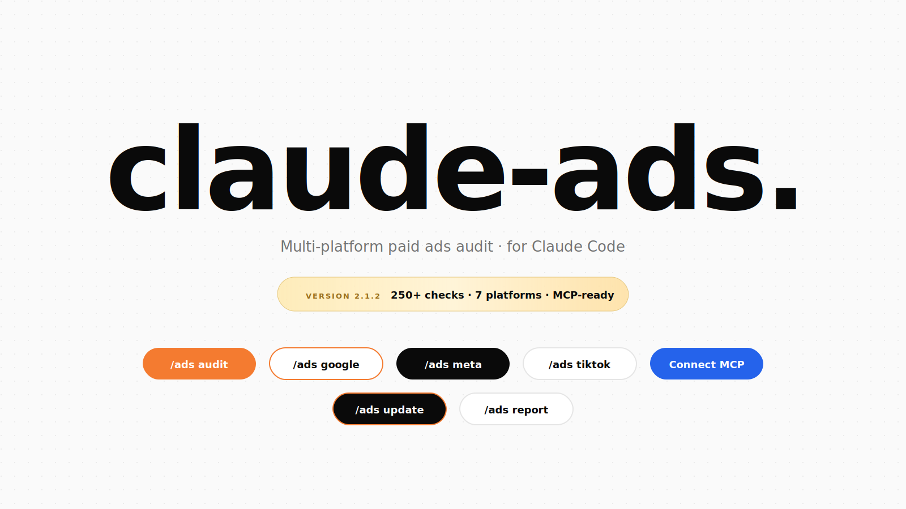
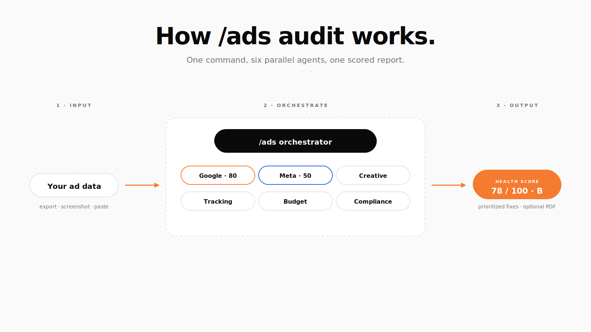
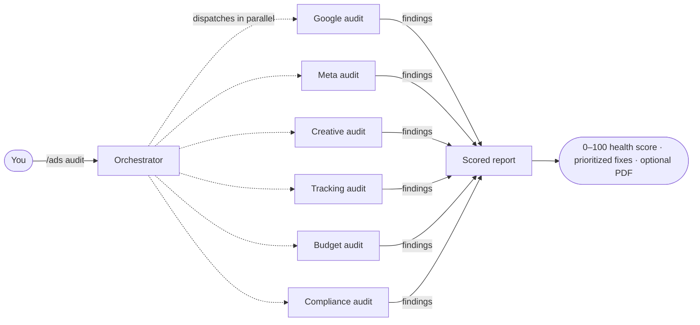
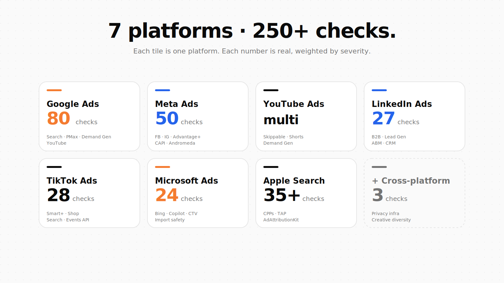
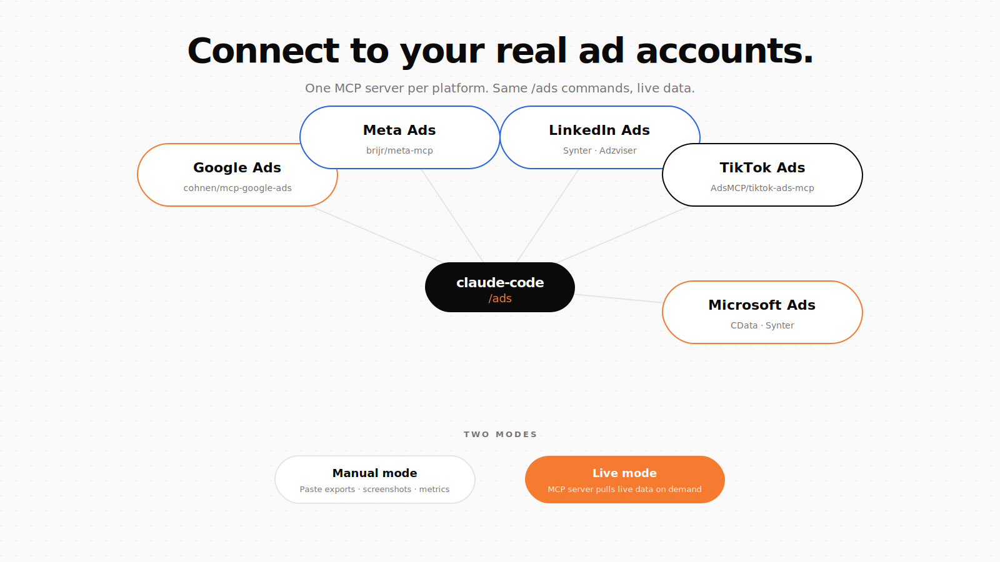
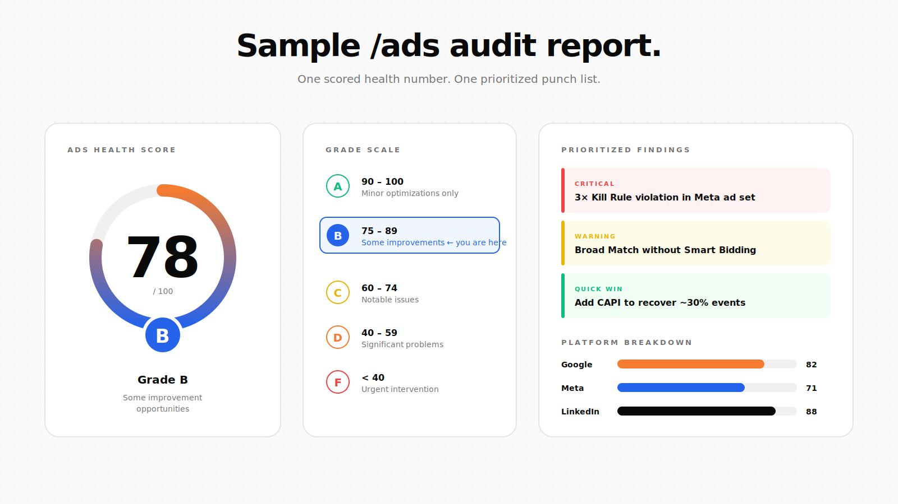

<div align="right">
<sub><strong>EN</strong> · <a href="README.es.md">Español</a></sub>
</div>

<p align="center">
  
</p>

# Claude Ads

> A free Claude Code skill that turns Claude into your in-house paid-ads team — audits, plans, scores, reports.

[](https://tododeia.com)
[](https://instagram.com/soyenriquerocha)
[](LICENSE)
[](https://github.com/Hainrixz/claude-ads/releases)
[](https://claude.ai/claude-code)

---

## What is this? (in plain English)

You know how you can ask Claude to review your code? **Claude Ads is the same idea, but for paid advertising.** Install it once, and Claude gets a brain transplant: it now knows Google Ads, Meta, YouTube, LinkedIn, TikTok, Microsoft Ads, and Apple Search Ads at a senior-strategist level — 250+ specific checks, 12 industry templates, and the ability to write you a real audit report at the end.

You drop in your ad data (an export, a screenshot, or just paste your numbers), type a command like `/ads audit`, and Claude runs six analysts in parallel — one per slice of your account. You get back a 0–100 health score, a prioritized punch list of what to fix, and (optionally) a polished PDF report you can hand a client.

It's not a magic button that runs your ads for you. It's a senior-level reviewer that lives inside your terminal, knows what's broken before you do, and never forgets to check the boring things (Consent Mode V2, CAPI, learning-phase rules, kill thresholds). And in v2.0+, it can update its own knowledge base monthly so it doesn't go stale.

---

## Quick start (90 seconds)

**Plugin install (recommended)** — registers as a native Claude Code plugin with auto-updates:

```shell
/plugin marketplace add Hainrixz/claude-ads
/plugin install claude-ads@tododeia-claude-ads
```

**Or one-liner install (Unix / macOS / Linux):**

```bash
curl -fsSL https://raw.githubusercontent.com/Hainrixz/claude-ads/main/install.sh | bash
```

**Or one-liner install (Windows PowerShell):**

```powershell
irm https://raw.githubusercontent.com/Hainrixz/claude-ads/main/install.ps1 | iex
```

Then open Claude Code and run your first audit:

```shell
claude
> /ads audit
```

Claude will ask you for your industry, monthly spend, and which platforms to include. Tell it. It does the rest.

---

## How it works

<p align="center">
  
</p>



The orchestrator (`/ads`) doesn't try to do everything itself. It dispatches six specialized agents in parallel — each with its own checklist, its own reference data loaded on-demand (RAG style), and its own severity weights. Their findings merge into a single scored report.

---

## What you can run

| Group | Command | What it does |
|---|---|---|
| **Audit** | `/ads audit` | Full multi-platform audit — 6 parallel agents, scored report |
| **Platform deep-dive** | `/ads google` | Google Ads (Search, PMax, Demand Gen, CTV, YouTube) — 80 checks |
| | `/ads meta` | Meta Ads (FB / IG / Advantage+) — 50 checks |
| | `/ads youtube` | YouTube Ads (Skippable, Shorts, Demand Gen) |
| | `/ads linkedin` | LinkedIn Ads (B2B, Lead Gen, TLA) — 27 checks |
| | `/ads tiktok` | TikTok Ads (Smart+, Shop, Search) — 28 checks |
| | `/ads microsoft` | Microsoft / Bing Ads (Copilot, import safety) — 24 checks |
| | `/ads apple` | Apple Search Ads (CPPs, AdAttributionKit, TAP) — 35+ checks |
| **Creative** | `/ads creative` | Cross-platform creative quality + fatigue detection |
| | `/ads landing` | Landing page conversion review |
| **Strategy** | `/ads plan <type>` | Strategic plan from 12 industry templates |
| | `/ads budget` | Budget allocation + bidding strategy review |
| | `/ads competitor` | Competitor ad intelligence across all platforms |
| **Numbers** | `/ads math` | PPC calculator: CPA, ROAS, break-even, LTV:CAC, MER |
| | `/ads test` | A/B test design (hypothesis, sample size, duration) |
| **Output** | `/ads report` | PDF audit report for client deliverables |
| **Maintenance** | `/ads update <platform\|all>` | Refresh references with last-30-day platform changes (NEW in v2.0) |

---

## Platforms covered

<p align="center">
  
</p>

| Platform | Checks | Focus areas |
|---|---|---|
| Google Ads | **80** | Search match types · PMax · AI Max · Demand Gen · CTV · YouTube |
| Meta Ads | **50** | Pixel + CAPI · Andromeda creative diversity · Advantage+ Shopping · audience structure |
| LinkedIn Ads | **27** | B2B targeting · TLA · Lead Gen · CRM integration |
| TikTok Ads | **28** | Creative-first · Smart+ · GMV Max · Search Ads · Events API |
| Microsoft Ads | **24** | Google import safety · Copilot · CTV · LinkedIn targeting |
| Apple Search Ads | **35+** | Campaign structure · CPPs · Maximize Conversions · AdAttributionKit |
| Cross-platform | **3** | Privacy infra · creative diversity · refresh cadence |
| **Total** | **250+** | weighted by severity into a 0–100 Ads Health Score |

---

## Connect to your real ad accounts

<p align="center">
  
</p>

Out of the box, Claude Ads runs in **manual mode** — you paste exports, screenshots, or numbers, and Claude analyzes them. That's the path of least resistance and works on every plan.

If you want Claude to read your ad accounts directly — turning the skill into a real ads agent that can pull live data on demand — connect an **MCP server** for the platform. MCP is Claude Code's plugin protocol for live data sources. You install one once, paste your API credentials into `~/.claude/.mcp.json`, and from then on Claude can call your ad platform on its own.

| Platform | MCP server | Install | Auth you'll need |
|---|---|---|---|
| **Google Ads** | [`cohnen/mcp-google-ads`](https://github.com/cohnen/mcp-google-ads) | `pip install -r requirements.txt` | Google Cloud project · Developer Token · OAuth refresh token · login customer ID |
| **Meta Ads** | [`brijr/meta-mcp`](https://github.com/brijr/meta-mcp) (open) or [Adspirer](https://www.adspirer.com) (commercial) | clone + `pip install -r requirements.txt` | Meta Business Manager · Marketing API access token |
| **LinkedIn Ads** | [Synter](https://syntermedia.ai/blog/mcp-server-linkedin-ads) or [Adzviser](https://adzviser.com) | SaaS signup, then add MCP entry | LinkedIn Marketing API OAuth (often handled by the service) |
| **TikTok Ads** | [`AdsMCP/tiktok-ads-mcp-server`](https://github.com/AdsMCP/tiktok-ads-mcp-server) | `uv sync` or `pip install -e .` | TikTok Developer Portal app ID + secret · advertiser OAuth |
| **Microsoft Ads** | [CData Bing Ads MCP](https://github.com/CDataSoftware/bing-ads-mcp-server-by-cdata) (read-only) or [Synter](https://syntermedia.ai) (read/write) | `mvn clean install` or SaaS signup | Microsoft Advertising OAuth |

> **Heads up.** Live mode means Claude can read — and with some MCP servers, **write** to — your real ad accounts. Start in read-only mode, point it at a sandbox or a low-spend account first, and only enable write access once you've watched it run a few times. The full per-platform setup walkthrough lives at [`ads/references/mcp-integration.md`](ads/references/mcp-integration.md).

---

## Industry templates

`/ads plan <type>` builds a full strategic ad plan from a template tuned to your business model — platform mix, campaign architecture, creative angles, targeting, budget split, and KPI targets included. Twelve are bundled:

| Template | Use it for |
|---|---|
| `saas` | SaaS / B2B software · trial + demo focus · Google + LinkedIn |
| `ecommerce` | DTC + ecom · Shopping / PMax · ROAS-driven · seasonal |
| `b2b-enterprise` | Enterprise B2B · LinkedIn ABM · long sales cycles |
| `local-service` | Plumbers, dentists, agencies · Google Search + LSA · call tracking |
| `info-products` | Coaches / courses · Meta + YouTube · webinar / VSL funnels |
| `mobile-app` | Mobile apps · Meta + Google UAC · MMP required |
| `real-estate` | Realtors · Special Ad Category (housing) · buyer/seller campaigns |
| `healthcare` | Clinics / health · HIPAA · LegitScript · restricted targeting |
| `finance` | Fintech / lending · Special Ad Category · required disclosures |
| `agency` | Multi-client management · reporting framework |
| `ecommerce-creative` | Ecom with heavy creative testing |
| `generic` | Universal questionnaire when none of the above fits |

---

## Showcase: what a `/ads audit` report looks like

<p align="center">
  
</p>

Every audit produces the same shape of output, so you (or your client) always know where to look:

| Section | What's in it |
|---|---|
| **Ads Health Score** | A single 0–100 number (and letter grade A–F) summarizing the account |
| **Platform breakdown** | Per-platform sub-scores so you can see where the account is bleeding |
| **Critical issues** | Hard violations (3× kill rule, broad match without smart bidding, missing CAPI) — fix these first |
| **Quick wins** | Things you can fix in under an hour with measurable lift |
| **Strategic recommendations** | Longer-term moves (creative refresh cadence, structure rebuilds) |
| **Compliance flags** | Special Ad Categories, Apple privacy, EU Consent Mode V2 status |

| Grade | Score | What it means |
|---|---|---|
| **A** | 90–100 | Minor optimizations only |
| **B** | 75–89 | Some improvement opportunities |
| **C** | 60–74 | Notable issues need attention |
| **D** | 40–59 | Significant problems present |
| **F** | <40 | Urgent intervention required |

Run `/ads report` after any audit to package the findings into a client-ready PDF (health-score gauge, platform charts, formatted tables, zero-overlap layout).

---

## `/ads update` — keeping the skill current

Ad platforms ship API changes, new features, and deprecations almost weekly. Your audit is only as good as your reference data. **`/ads update <platform|all>` regenerates the per-platform reference files** with the last 30 days of changes from official changelogs (Google, Meta, TikTok, LinkedIn, Microsoft, Apple), practitioner discussion (r/PPC, r/GoogleAds, r/FacebookAds, r/adops, Hacker News), and industry press (Search Engine Land, AdWeek, MarTech) via WebSearch fallback.

The pipeline is adapted from [last30days-skill](https://github.com/mvanhorn/last30days-skill) (MIT, by Matt Van Horn — see [`scripts/lib/THIRD_PARTY_NOTICES.md`](scripts/lib/THIRD_PARTY_NOTICES.md)).

| Mode | Approx. cost | Recommended cadence |
|---|---|---|
| `/ads update <one platform>` | 50–150k tokens | Monthly per platform |
| `/ads update all` | 500k+ tokens | Monthly, off-peak |

`/ads update` always asks for confirmation and shows the cost estimate before running — you can cancel or fall back to `--depth quick`. On a low-credit plan, prefer per-platform mode, run monthly (not daily), and switch to Sonnet for the run. Reference data stays valid ~30 days; daily reruns waste credits without producing meaningfully different output.

Full details: [`skills/ads-update/SKILL.md`](skills/ads-update/SKILL.md).

---

## What's different in this fork

This is a community fork by [tododeia.com](https://tododeia.com) of the upstream open-source `claude-ads` project (MIT). The honest 30-second summary of what's actually different:

- **`/ads update` (NEW in v2.0)** — self-refreshing platform knowledge powered by a vendored time-bounded research pipeline. The upstream skill never updated itself; this fork does.
- **Refreshed 2026 platform references** — Apple Search Ads expansion, AdAttributionKit, Andromeda creative diversity, Consent Mode V2 + EU policy hooks.
- **Maintenance, identity, visual rebrand** — bug fixes (install path coverage, version strings, phantom file refs), tododeia branding, this README.

The original 250+ checks, 19 sub-skills, 10 agents, 12 templates, MCP integration guide, and the audit/scoring/reporting pipeline all come from the upstream project — credit goes to the original maintainer. See [`CHANGELOG.md`](CHANGELOG.md) for the full history.

---

## Privacy & data handling

- **Local execution.** Claude Ads runs entirely inside your local Claude Code session. No ad-account data is sent to tododeia, the original author, or any third-party server.
- **No credentials stored in the repo.** MCP credentials live in your own `~/.claude/.mcp.json`, never in the skill.
- **SSRF-validated URL fetches.** Landing-page analysis blocks private IP ranges and validates URLs before fetching ([`scripts/url_utils.py`](scripts/url_utils.py)).
- **`/ads update` outbound calls.** This command makes public-internet HTTP calls (Reddit JSON, Hacker News Algolia, official changelog pages, WebSearch) to gather platform changes — none of your ad data is sent in those calls.

---

## FAQ

**Does Claude Ads log into my ad manager automatically?**
Not by default — it analyzes data you provide. If you want live access, install the matching MCP server for your platform (see [Connect to your real ad accounts](#connect-to-your-real-ad-accounts)).

**Can it create or edit ads for me?**
Even with a write-capable MCP server connected, Claude Ads is positioned as an audit + strategy tool: find issues, recommend fixes, build campaign plans. Whether to actually write changes back to your ad account is your call to enable per-MCP — it's not on by default.

**How fresh are the benchmarks and platform rules?**
Built-in references are curated by the maintainer. `/ads update` refreshes per-platform changelogs monthly with the last 30 days of changes. Run it monthly to stay current.

**My account is small — are these benchmarks even relevant?**
Tell Claude your monthly spend upfront. *"I spend $2k/month on Google Ads for a local plumbing business"* gives much better results than running `/ads google` cold. Benchmarks differ a lot between $500/mo and $50k/mo accounts.

**Will `/ads update all` blow my credits?**
It can — see the [`/ads update` cost table](#ads-update--keeping-the-skill-current). Use per-platform mode on a tight budget, run monthly not daily, pick Sonnet over Opus for the run.

**Which platforms aren't covered?**
First-class: Google · Meta · YouTube · LinkedIn · TikTok · Microsoft · Apple. Reddit, CTV/OTT, Pinterest, Snapchat are covered for strategic planning but not full audit.

---

## Requirements

- Claude Code CLI
- Python 3.10+
- Playwright (optional, for live landing-page analysis)
- reportlab (optional, for `/ads report` PDF generation)

---

## Uninstall

```bash
# Unix / macOS / Linux
curl -fsSL https://raw.githubusercontent.com/Hainrixz/claude-ads/main/uninstall.sh | bash
```

```powershell
# Windows PowerShell
irm https://raw.githubusercontent.com/Hainrixz/claude-ads/main/uninstall.ps1 | iex
```

---

## Credits

Maintained by [**tododeia.com**](https://tododeia.com) · Enrique Henry · [@soyenriquerocha](https://instagram.com/soyenriquerocha).

Originally based on the open-source `claude-ads` project (MIT). The vendored time-bounded research pipeline that powers `/ads update` is adapted from [last30days-skill](https://github.com/mvanhorn/last30days-skill) (MIT, by Matt Van Horn) — see [`scripts/lib/THIRD_PARTY_NOTICES.md`](scripts/lib/THIRD_PARTY_NOTICES.md).

## License

MIT — see [LICENSE](LICENSE).
